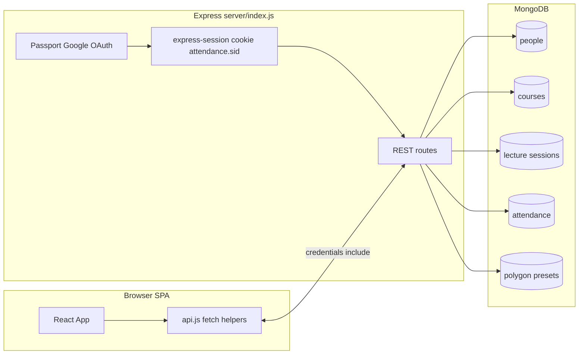

# UOP Attendance Management System

Role-based web application for lecture attendance at the University of Peradeniya. Students mark attendance for **live** sessions by scanning a **rotating BLE token** broadcast from the classroom Bluetooth beacon; **lecturers** and **admins** manage courses, sessions, and reporting.

**Repository type:** private application (`package.json` → `"private": true`). **No `LICENSE` file** is present in this repo—treat usage and distribution as defined by your institution.

---

## Purpose

- Give students a single place to record attendance when a session is **actively running** (same calendar day and clock time as the session slot).
- Tie attendance to **verified identity** (Google OAuth + server session), a **rotating BLE token** broadcast by the classroom Bluetooth beacon, and the active **schedule window**.
- Let staff create and operate sessions, control BLE broadcasting, export matrices, and maintain reusable map presets.

---

## Core features

| Area | Capabilities |
|------|----------------|
| **Students** | Google sign-in; pick a **running** course from the combobox; tap **Scan for Bluetooth Attendance** (requires Chrome on Android); browser BLE picker opens filtered to the session's `UOP-XXXXXXXX` device; device advertises a rotating 8-byte token in manufacturer data (`0xFFFF`); client submits hex token to `/api/bluetooth-attendance`; attendance status polling per course. |
| **Lecturers** | Staff console: courses assigned to them (multi-owner supported), session CRUD, **BLE broadcasting control** (start/stop per session card), live PIN, attendance matrix, presentation route for PIN, and **live attendance gating** (`attendancePaused`) using the blinking **Live** badge. |
| **Admins** | Same as lecturers for any course, plus lecturer directory, draw polygon presets, multi-lecturer course assignment, full course lifecycle. |
| **System** | In-memory rotating PIN per session (`server/lib/lectureCode.js`, **30 s** window when enabled); **in-memory BLE token** per session (`server/lib/bluetoothCode.js`, rotates automatically every **15 s** via a background `setInterval`); non-recurring session auto-deactivate via background job; date-sensitive server keys use **host-local Y-M-D** (not UTC slices, unless you force `TZ`). |

---

## Tech stack

| Layer | Technology |
|-------|------------|
| **Frontend** | React 19, React Router 6, Create React App (`react-scripts` 5), Leaflet / react-leaflet 5, `fetch` + credentialed CORS. |
| **Backend** | Node.js, **Express 5**, Mongoose 9, Passport + `passport-google-oauth20`, `express-session` + **`connect-mongo`** (persistent sessions), **`helmet`** (security headers), **`express-rate-limit`** (per-route brute-force/DOS protection), `cors`, `dotenv`. |
| **Data** | MongoDB (documents: people, courses, lecture sessions, attendance, polygon presets, sessions). |
| **Tooling** | `concurrently` for `npm run dev`; optional Excel export via `xlsx` on the client (`matrixExcel.js`). |

---

## Architecture overview



- **Single-process API** in `server/index.js` (large file: models, geofence math, auth helpers, and HTTP handlers).
- **Session-based auth**: Passport serializes `Person._id`; staff vs student routes use `sessionStaffAuth` / `sessionStudentAuth` after reloading `Person` from MongoDB.
- **PIN and BLE token state** lives in **process memory** (`lectureCode.js` and `bluetoothCode.js` `Map` stores), not MongoDB—**server restarts** drop rotation state. BLE tokens are seeded immediately when BT is enabled and rotated by a background `setInterval`; PIN codes re-materialize on the next `current-code` fetch.
- **Local dev split**: default CRA dev is `http://localhost:3000`; API defaults to port **5000**. `src/api.js` points `REACT_APP_API_BASE` or `localhost:5000` when the app runs on port 3000.

---

## Project structure

```
.
├── public/                 # CRA static assets
├── src/
│   ├── App.js              # Routes, auth guards (localStorage + role)
│   ├── index.js            # StrictMode, BrowserRouter, ErrorBoundary
│   ├── index.css           # Global + component-adjacent utility styles
│   ├── layouts/            # MarketingLayout, StudentLayout, AdminLayout + layouts.css
│   ├── components/         # Login, GoogleSuccess, LectureEntry, AdminDashboard, …
│   ├── api.js              # All HTTP helpers; safeFetchJson; 401 → notifySessionInvalid
│   └── utils/              # safeStorage, authRedirect, matrixExcel
├── server/
│   ├── index.js            # Express app, OAuth, index sync, all API routes
│   ├── models/             # Person, Course, LectureSession, Attendance, PolygonPreset
│   └── lib/                # lectureCode.js, bluetoothCode.js, schedule.js, sessionExpiry.js
├── deploy/
│   └── nginx-app-domain.conf   # Example reverse-proxy (API + auth + SPA)
├── package.json
└── README.md
```

---

## Environment variables

Create a **`.env`** file in the **project root** (not committed—verify with your team). Most names below are consumed directly in `server/index.js`, `sessionExpiry.js`, or `src/api.js`; `TZ` affects Node's runtime timezone behavior even when not explicitly read in code.

| Variable | Required | Description |
|----------|----------|-------------|
| `MONGO_URI` | Recommended | Mongo connection string. Default in code: `mongodb://localhost:27017/attendance`. Also used by the `connect-mongo` session store. |
| `GOOGLE_CLIENT_ID` | Yes (OAuth) | Google OAuth client ID |
| `GOOGLE_CLIENT_SECRET` | Yes (OAuth) | Google OAuth secret |
| `SESSION_SECRET` | **Required in production** | Session HMAC secret. Server **fails to boot** in production if missing. Dev fallback exists. |
| `FRONTEND_URL` | Strongly recommended | Allowed CORS origin(s) for SPA; **comma-separated**, no trailing slash issues handled in code. Used after OAuth as redirect target base. |
| `APP_BASE_URL` | Recommended for OAuth | Public origin used to build Google **`callbackURL`** (`…/auth/google/callback`). Fallback chain in strategy setup includes `FRONTEND_URL` / `REACT_APP_API_BASE`. |
| `REACT_APP_API_BASE` | Optional | CRA: absolute API origin (e.g. `http://localhost:5000`) when SPA and API differ. Empty string = same origin (typical reverse proxy). |
| `NODE_ENV` | Deployment | `production` enables **Secure** + **SameSite=None** session cookies (HTTPS required for cross-site cookies). |
| `PORT` | Optional | Express listen port; default **5000** |
| `TZ` | Optional | Server timezone for schedule comparisons. If unset, Node uses the host system timezone. Set only when you need to force a specific timezone. |
| `SESSION_EXPIRE_JOB_MS` | Optional | Interval for non-recurring session sweep; min **10000**, default **60000** (`sessionExpiry.js`) |
| `CSP_EXTRA_CONNECT_SRC` | Optional (production) | Extra origins to append to the CSP `connect-src` directive — needed when the SPA fetches an API on a **different** origin (split-host deploys). Comma-separated. Example: `https://api.example.com,https://cdn.example.com`. Ignored unless `NODE_ENV=production`. |
| `CSP_REPORT_ONLY` | Optional (production) | If `1` / `true`, the server emits `Content-Security-Policy-Report-Only` instead of the enforcing header so blocked resources are reported to DevTools but still load. Use to roll out CSP safely on staging. Ignored unless `NODE_ENV=production`. |

**CRA note:** Only variables prefixed with `REACT_APP_` are exposed to the browser at build time.

---

## Database setup

1. Install and start **MongoDB** locally or use Atlas / managed Mongo.
2. Set `MONGO_URI` in `.env`.
3. Start the server once: Mongoose creates/uses collections and syncs indexes on startup. Review server logs on first boot.
4. On startup, the server ensures a bootstrap admin record exists for `udayakavindadev@gmail.com` (idempotent role/active/deleted correction).

**Important indexes:** `Attendance` has a **unique compound index** on `(student, session, attendanceDate)` for idempotent same-day recording.

---

## Install, run, build

```bash
npm install
```

**Development (SPA + API):**

```bash
npm run dev
```

- Frontend: `http://localhost:3000` (CRA)
- API: `http://localhost:5000` (unless `PORT` is set)

Ensure `FRONTEND_URL` includes `http://localhost:3000` for CORS when using split ports.

**Backend only:**

```bash
npm run server
```

**Production build (static React):**

```bash
npm run build
```

Serve the `build/` folder behind the same origin as `/api` and `/auth` (recommended), or set `REACT_APP_API_BASE` to the API origin and configure CORS accordingly.

**Other scripts:** `npm start` (CRA dev, client only), `npm test`, `npm run tunnel` (expects **`ngrok`** on PATH—not an npm dependency).

---

## Deployment (concise)

Prefer a **single hostname** reverse proxy:

| Path | Target |
|------|--------|
| `/api/*` | Node (Express) |
| `/auth/*` | Node (Passport OAuth callback) |
| `/*` | Static `build/` or Node SSR (not included) |

Example: `deploy/nginx-app-domain.conf`.

**Google Cloud Console:** Authorized JavaScript origin and **redirect URI** must match how users reach the app (e.g. `https://app.example.com` and `https://app.example.com/auth/google/callback` if the API handles `/auth` on that host).

**Sessions:** Stored in MongoDB via **`connect-mongo`** (collection `sessions`). Sessions survive Node restarts and horizontal scaling; the SPA still handles transient `401` via `notifySessionInvalid`.

---

## API overview

**Conventions**

- JSON bodies for `POST`/`PATCH` where applicable.
- **Cookie**: `attendance.sid` (HTTP-only); clients must use `credentials: 'include'` (`safeFetchJson` in `src/api.js`).
- **401**: unauthenticated or invalid session; **403**: authenticated but wrong role or course access.

### Auth & profile

| Method | Path | Notes |
|--------|------|--------|
| GET | `/auth/google` | Starts OAuth (503 JSON if Google env missing). Rate-limited. |
| GET | `/auth/google/callback` | OAuth callback → redirect to `FRONTEND_URL`/`…`/login/success. Rate-limited. |
| GET | `/api/me` | Session required → `{ studentId, email, role, lecturerId }` |
| POST | `/api/logout` | Destroy session |
| GET | `/api/healthz` | Liveness/readiness probe (`200` with Mongo `readyState===1`, else `503`) |

### Read endpoints (session required)

| Method | Path | Notes |
|--------|------|--------|
| GET | `/api/courses` | Active courses (summary). **Auth required**. |
| GET | `/api/courses/running` | Courses with an active session **right now**. **Auth required**. |

### Student (session + `role === 'student'`)

| Method | Path | Notes |
|--------|------|--------|
| GET | `/api/attendance-status?courseId=` | Same-day attendance for session-in-window |
| GET | `/api/bluetooth-target?courseId=` | Returns `{ deviceName }` when BT is enabled for the active session; client uses `deviceName` to filter the BLE device picker. |
| POST | `/api/bluetooth-attendance` | Body: `{ courseId, token }`. Validates 16-char hex token against the session's rotating store (`bluetoothCode.verifyToken()`); creates `Attendance` with `method: 'bluetooth'` (token stored in `lectureCode` field). Returns `{ success: true }` or `{ duplicate: true }` for same-session re-records. **Rate-limited** (~60 req/min per authenticated user; IP fallback). |

> **Legacy (unused by current frontend):** `/api/verify-lecture-pin` and `/api/record-attendance` (PIN + GPS geofence flow) still exist in `server/index.js` but are no longer called by `LectureEntry.jsx` on this branch.

### Staff (`lecturer` or `admin`; course-scoped for lecturers)

| Method | Path | Notes |
|--------|------|--------|
| GET | `/api/lecture-code?courseId=` | Live PIN for active session (staff; lecturer must be assigned to the course) |
| GET | `/api/admin/courses` | Staff course list |
| POST | `/api/admin/courses` | Create (admins send `lecturerIds` array with 1..5 lecturer IDs) |
| DELETE | `/api/admin/courses/:courseId` | Delete (transactional: attendance, sessions, and course are removed atomically). |
| PATCH | `/api/admin/courses/:courseId/disable` | |
| PATCH | `/api/admin/courses/:courseId/enable` | |
| PATCH | `/api/admin/courses/:courseId/assign-lecturer` | Admin (body: `lecturerIds` array, 1..5 unique lecturer IDs) |
| GET | `/api/admin/courses/:courseId/sessions` | |
| POST | `/api/admin/courses/:courseId/sessions` | Create session (rejects same-course same-day overlapping time windows). |
| GET | `/api/admin/sessions` | |
| GET | `/api/admin/sessions/current-codes` | Includes `attendancePaused` and rotation state for live cards. |
| GET | `/api/admin/sessions/:sessionId/current-code` | Also calls `syncSessionCodeMode` while the session is in its scheduled window; includes `attendancePaused` for presenter mode. |
| PATCH | `/api/admin/sessions/:sessionId/activate` | |
| PATCH | `/api/admin/sessions/:sessionId/deactivate` | |
| DELETE | `/api/admin/sessions/:sessionId` | Soft-delete (`deleted=true`, `active=false`); attendance rows are preserved for reporting. |
| PATCH | `/api/admin/sessions/:sessionId/rotation/start` | Enable rotation and **resume** if paused (`rotationEnabled=true`, `rotationPaused=false`). |
| PATCH | `/api/admin/sessions/:sessionId/rotation/stop` | Keep rotation enabled but **pause** it so the current PIN stays on screen (`rotationPaused=true`). |
| PATCH | `/api/admin/sessions/:sessionId/attendance-paused` | Pause/resume student attendance for the **current** live window. Auto-clears for new occurrences (next live run starts unpaused). |
| PATCH | `/api/admin/sessions/:sessionId/bluetooth/start` | Enable BLE broadcasting mode; generates `bluetoothDeviceName` (`UOP-XXXXXXXX`) on first call and persists it to DB; sets `bluetoothEnabled=true`. |
| PATCH | `/api/admin/sessions/:sessionId/bluetooth/stop` | Disable BLE broadcasting; sets `bluetoothEnabled=false`; clears the in-memory token via `bluetoothCode.removeToken()`. |
| GET | `/api/admin/sessions/:sessionId/bluetooth-broadcast` | **For native broadcaster app only.** Returns `{ deviceName, token, rotatesIn, rotationMs }` so an external app can advertise the current rotating token over BLE. Staff auth required. |
| GET | `/api/admin/courses/:courseId/attendance-matrix` | |
| GET | `/api/admin/lecturers?q=` | Admin |
| POST | `/api/admin/lecturers` | Admin |
| PATCH | `/api/admin/lecturers/:id` | Admin |
| DELETE | `/api/admin/lecturers/:id` | Admin. Removes lecturer from course owners; if that would leave a course with zero owners, reassigns a fallback active lecturer (otherwise returns 400). |
| GET | `/api/admin/polygon-presets` | |
| POST | `/api/admin/polygon-presets` | Admin |
| PATCH | `/api/admin/polygon-presets/:id` | Admin |
| DELETE | `/api/admin/polygon-presets/:id` | Admin |

---

## Content Security Policy

CSP is **enforced only when `NODE_ENV=production`** (CRA's dev server uses `eval` for source maps, which a strict CSP would block). The policy is built from the actual external origins the app loads:

```
default-src 'self';
base-uri 'self';
object-src 'none';
script-src 'self';
script-src-attr 'none';
style-src 'self' 'unsafe-inline' https://fonts.googleapis.com;
font-src 'self' data: https://fonts.gstatic.com;
img-src 'self' data: blob:
  https://*.tile.openstreetmap.org
  https://server.arcgisonline.com;
connect-src 'self' [+ CSP_EXTRA_CONNECT_SRC];
frame-ancestors 'none';
form-action 'self' https://accounts.google.com;
worker-src 'self' blob:;
manifest-src 'self';
upgrade-insecure-requests;
```

**Allow-list rationale**

| Origin | Why it's allowed |
|---|---|
| `https://fonts.googleapis.com` | Inter font CSS in `public/index.html` |
| `https://fonts.gstatic.com` | Inter `.woff2` files |
| `https://*.tile.openstreetmap.org` | OpenStreetMap base layer in `AdminDashboard.jsx` |
| `https://server.arcgisonline.com` | Esri satellite layer in `AdminDashboard.jsx` |
| `https://accounts.google.com` (`form-action`) | OAuth redirect target |
| `'unsafe-inline'` for `style-src` | Leaflet sets inline `transform:` styles on map markers; script XSS remains blocked |

**Rolling it out safely**

1. Deploy with `CSP_REPORT_ONLY=1`. Browsers send `Content-Security-Policy-Report-Only` so violations show up in DevTools (`Reports` tab) without breaking the page.
2. Use the app on staging across all roles for a session — note any `[CSP]` violation reports.
3. If you added a new external resource (new map provider, analytics, etc.), either add its origin to the directives in `server/index.js` or to `CSP_EXTRA_CONNECT_SRC` (for fetch/XHR origins only).
4. Unset `CSP_REPORT_ONLY` to enforce.

If your deployment serves the SPA and the API on **different hostnames** (i.e. `REACT_APP_API_BASE` is set to a different origin), add that API origin to `CSP_EXTRA_CONNECT_SRC` so the browser will allow `fetch()` to it.

---

## Authentication and authorization flow

1. User visits `/` → `Login` can redirect to **`/auth/google`** on the **API origin** (full URL depends on deployment).
2. Google returns to **`/auth/google/callback`**; Passport establishes session (persisted in MongoDB via `connect-mongo`) and redirects to **`{FRONTEND_URL}/login/success`**.
3. `GoogleSuccess` calls **`GET /api/me`** with credentials and writes **`localStorage`** key `student` as a cache snapshot.
4. `App` re-validates session state via **`GET /api/me`** on load; this server response is the routing source of truth (`student` → `/lecture`; `lecturer` / `admin` → `/admin`).

**Role source of truth:** `Person.role` in MongoDB (`student` | `lecturer` | `admin`). Google callback can **promote** to `lecturer` if email matches an active lecturer row (see `server/index.js` Google strategy).

**Bootstrap admin:** startup enforces `udayakavindadev@gmail.com` as an active, non-deleted `admin` record for emergency access in fresh databases.

---

## Student attendance flow (implementation)

Attendance is recorded via **Web Bluetooth** — no PIN entry or GPS required.

1. `GET /api/courses/running` populates the course combobox (polling every 10 s).
2. Student picks a running course and taps **📡 Scan for Bluetooth Attendance**.
3. Client calls `GET /api/bluetooth-target?courseId=…` to fetch `{ deviceName }`. If BT is disabled on the active session, the API returns an error and the scan is aborted.
4. `navigator.bluetooth.requestDevice({ filters: [{ name: deviceName }], optionalManufacturerData: [0xFFFF] })` opens the OS BLE picker, pre-filtered to the session's `UOP-XXXXXXXX` beacon.
5. `device.watchAdvertisements({ signal: abortController.signal })` begins listening for BLE advertisements. A 30 s timeout fires `AbortController.abort()` if no packet arrives.
6. On `advertisementreceived`: manufacturer data for company ID `0xFFFF` is read as 8 bytes → 16-char hex token.
7. `POST /api/bluetooth-attendance` `{ courseId, token }` — server calls `bluetoothCode.verifyToken(sessionId, token)` (string equality check against the current window's token). On match, creates an `Attendance` record with `method: 'bluetooth'`.
8. On `{ success }` or `{ duplicate }`, `recorded=true` is set and the success screen is shown.

Staff live control notes:
- **📡 BT on / BT off** pill buttons on each session card control `bluetoothEnabled`. When enabled, the device badge (`UOP-XXXXXXXX`) is shown.
- The **blinking Live badge** (`attendancePaused`) pauses/resumes student submissions independently of BLE broadcasting.
- A separate **native broadcaster app** must call `GET /api/admin/sessions/:id/bluetooth-broadcast` and advertise the returned token; the web dashboard controls only enable/disable.

**Browser support:** Web Bluetooth (`navigator.bluetooth.requestDevice` + `watchAdvertisements`) is available on **Chrome for Android** (and Chrome OS). It is **not** available in Safari, Firefox, or Chrome on iOS. Students on unsupported browsers see an error message.

---

## Development conventions

- **API client:** Add new calls to `src/api.js` using **`safeFetchJson`**; preserve **`credentials: 'include'`** and **401 handling** (`notifySessionInvalid`).
- **Styles:** Global `src/index.css`; layout-specific `src/layouts/layouts.css`. BEM-style class names appear in places (`student-empty__text`, `primary-btn--location-check`).
- **Maps:** Leaflet assets; admin/student flows use React hooks and functional components.
- **Error handling:** Root **`ErrorBoundary`**; dev-only `unhandledrejection` logging in `src/index.js`.

---

## Known limitations and assumptions

| Topic | Detail |
|-------|--------|
| **BLE browser support** | `navigator.bluetooth.requestDevice` + `watchAdvertisements` is only available on **Chrome for Android** (and Chrome OS). Safari, Firefox, and Chrome on iOS will fail. Students on unsupported browsers see an explicit error message. |
| **BLE broadcaster** | The web dashboard cannot advertise BLE—browsers have no BLE peripheral API. A **separate native app** must call `GET /api/admin/sessions/:id/bluetooth-broadcast` and broadcast the returned token. Without the broadcaster running, students cannot record attendance. |
| **BLE token rotation** | Automatic every **15 s** — a `setInterval` in `bluetoothCode.js` sweeps the in-memory store every 1 s and replaces any token whose window has elapsed. No broadcaster poll required to trigger rotation. |
| **PIN / token storage** | In-memory per server process; **not** durable across restarts or horizontal scaling without redesign. |
| **Public discovery** | `/api/courses` and `/api/courses/running` require an authenticated session. |
| **Client guards** | Route protection is server-authoritative via **`/api/me`**; localStorage is cache-only and must not be trusted for authorization. |
| **Tests** | CRA test stack present; **no comprehensive API integration tests** in repo were verified for this README. |

---

## Troubleshooting

| Symptom | Things to check |
|---------|-------------------|
| CORS errors | `FRONTEND_URL` matches browser origin exactly; `credentials: true` on server; no mixed `www` vs bare domain. |
| OAuth redirect mismatch | Google Console redirect URI matches **`APP_BASE_URL` + `/auth/google/callback`** (or relative path if relative callback is registered, which is uncommon). |
| 401 after deploy | Sessions are persisted in Mongo (`connect-mongo`), so mass logout is no longer expected. Check `SESSION_SECRET`, cookie domain/protocol (`Secure`/`SameSite`), and whether deploy changed host/origin unexpectedly. |
| PIN always invalid | Clock skew; session not “running” (day/time); rotation paused; wrong `courseId`; server restarted (new code). |
| “Scan” button missing / disabled | Web Bluetooth is not supported on this browser — student must use Chrome on Android. Chrome on iOS does not support it. |
| BLE device not found in picker | Student is too far from the broadcaster; broadcaster app is not running; session does not have BT enabled (staff must tap **📡 BT on**); device name mismatch (unlikely — server returns the exact name stored in DB). |
| “No Bluetooth signal received in 30 s” | Broadcaster is running but student is out of BLE range (typically < 10 m in open air, less through walls); move closer to the classroom. Also check that `advertisementreceived` fires with manufacturer data — some OS/browser combos drop packets. |
| Token validation fails (“Verification failed”) | Student scanned just as the 15 s token rotated — the scanned packet carried the old token but the server has already replaced it. Student should tap Scan again immediately; the next advertisement will carry the new token. |
| Startup index sync errors | Inspect startup logs in `server/index.js` connect handler; ensure DB user has index-management permissions. |

---

## Contributing

1. Work on a feature branch; keep changes focused.
2. Match existing patterns in `src/api.js`, `server/index.js` auth helpers, and component style.
3. Run **`npm run build`** before sharing frontend changes; **`node --check server/index.js`** for syntax after server edits.
4. Update this README when adding env vars, routes, or auth behavior—**documentation drift** has been an issue historically.

---

## AI Context (for coding assistants)

**Goals when editing this repo**

- Prefer **small, reviewable diffs**; do not refactor `server/index.js` broadly without explicit instruction.
- **Never** trust `studentId` from request body for authorization—use `sessionStudentAuth` / `req.user` patterns already in place.
- **Preserve** `safeFetchJson` and **401 → `notifySessionInvalid`** behavior for session coherence.

**Architecture patterns**

- Monolithic Express file with inline helpers (`resolveActiveSessionForCourse`, geofence, schedule checks) plus shared scheduling helpers in `server/lib/schedule.js`.
- Mongoose models in `server/models/`.
- React SPA with **layout routes** and **role gates** in `App.js` (localStorage snapshot of `/api/me`).

**State management**

- **React component state and hooks only**—no Redux or global client store.

**Styling**

- CSS files (`index.css`, `layouts.css`); utility classes like `primary-btn`, `card-content`, `input`.

**Naming**

- Mongo: `Person` model, `people` collection historically; routes under `/api/admin/…`.
- Course ownership is stored in `Course.lecturers` (1..5 assigned lecturers per course).
- Session cookie name: **`attendance.sid`**.

**Sensitive / high-impact areas (edit carefully)**

- **`server/index.js`**: OAuth strategy, session cookie flags, CORS, startup index sync, attendance logic.
- **`server/lib/lectureCode.js`**: PIN generation and validation contract with clients.
- **`server/lib/bluetoothCode.js`**: BLE token generation, rotation, and verification; token lifetime and in-memory store.
- **`src/utils/authRedirect.js`**, **`src/api.js`**: session invalidation and base URL logic.

---

## Codebase invariants (current state)

This table is the quick reference for facts the rest of the README depends on. Update it together with the code if any of these change.

| Item | Current state | Source |
|------|---------------|--------|
| Student flow | **BLE scan** — student taps "Scan for Bluetooth Attendance", browser BLE picker opens, device advertises 8-byte token in manufacturer data (`0xFFFF`), client calls `/api/bluetooth-attendance` with hex token; no PIN entry, no GPS. | `src/components/LectureEntry.jsx` |
| BLE token | 8 random bytes = 16-char hex. Rotates automatically every **15 s** via a `setInterval` sweep in `bluetoothCode.js`; seeded immediately when BT is enabled. Verified by `bluetoothCode.verifyToken(sessionId, token)`. Stored in `Attendance.lectureCode` field for bluetooth rows. | `server/lib/bluetoothCode.js`, `server/models/Attendance.js` |
| BLE device name | Fixed per session lifetime — `'UOP-' + 4 random hex bytes uppercase` (e.g. `UOP-A3F7C201`). Generated once on first `bluetooth/start` call and persisted in `LectureSession.bluetoothDeviceName`. | `server/lib/bluetoothCode.js`, `server/models/LectureSession.js` |
| Attendance method enum | `['google', 'bluetooth']` — `'bluetooth'` added for BLE-recorded rows. | `server/models/Attendance.js` |
| PIN rotation | **30 s** window when rotation is active (`ROTATION_MS`); rotation can be paused independently of attendance acceptance. | `server/lib/lectureCode.js` |
| Token / PIN storage | **In-process memory** only (Map). Server restart drops both PIN rotation state and BLE tokens. | `server/lib/lectureCode.js`, `server/lib/bluetoothCode.js` |
| Sessions persistence | `express-session` + **`connect-mongo`** (collection `sessions`, TTL 7 d). Survives Node restarts and horizontal scaling. | `server/index.js` |
| Security middleware | **`helmet`** with **production-only CSP** (allow-list of OSM/Esri tiles, Google Fonts; everything else `'self'`; `frame-ancestors 'none'`; toggleable via `CSP_REPORT_ONLY` and extendable via `CSP_EXTRA_CONNECT_SRC`); **`cors`** (allow-list, credentialed); **`express-rate-limit`** (per-user via `limiterKeyByUserOrIp`; IP fallback wraps `req.ip` with `rateLimit.ipKeyGenerator()` so IPv6 clients can't bypass limits by rotating addresses — required by `express-rate-limit` v8 `ERR_ERL_KEY_GEN_IPV6` validator). | `server/index.js` |
| Course ownership | Multi-owner: each course stores `lecturers` (array of 1..5 unique lecturer IDs), and any assigned lecturer has course-scoped staff access. | `server/models/Course.js`, `server/index.js` |
| Course delete consistency | `DELETE /api/admin/courses/:courseId` runs in a Mongo transaction so attendance, sessions, and course delete succeed/fail together. | `server/index.js` |
| Duplicate attendance | `/api/bluetooth-attendance` returns `{ success: true, duplicate: true }` for same-session re-records (pre-check **and** unique-index catch on `11000`), never 500. | `server/index.js` |
| Public discovery | `/api/courses` and `/api/courses/running` require an authenticated session. | `server/index.js` |
| Removed | `POST /api/login` (unauthenticated user-enumeration oracle) and the `login()` helper in `src/api.js`. | — |
| Removed | Legacy one-shot endpoint `POST /api/verify-lecture` (superseded by the PIN+GPS flow, which is itself superseded by BLE on this branch). | `server/index.js`, `src/api.js` |
| Timezone | Server date/day logic uses host system local time (`localYmd`) unless `TZ` is explicitly set in the environment; Excel filename date uses system-local Y-M-D (`systemLocalYmd`). | `server/index.js`, `src/utils/matrixExcel.js` |
| Live attendance gating | Per-session `attendancePaused` flag toggled via the **blinking Live badge** in Session control or the projector view. Auto-clears when a new daily occurrence rolls over. | `server/models/LectureSession.js`, `src/components/AdminDashboard.jsx`, `src/components/SessionPinPresentPage.jsx` |
| Schedule helpers | Shared scheduling/day helpers are centralized in `server/lib/schedule.js` and reused by API + expiry job. | `server/lib/schedule.js`, `server/index.js`, `server/lib/sessionExpiry.js` |
| Bootstrap admin | Startup ensures `udayakavindadev@gmail.com` exists as active non-deleted `admin`; creates record if missing. | `server/index.js` |
| License | **No `LICENSE` file**; package is `"private": true` in `package.json`. | `package.json` |

---

## License

No license file is included. **`package.json` declares `"private": true`.** Use and redistribution are subject to your institution’s policies; add a `LICENSE` file if you intend open-source distribution.
