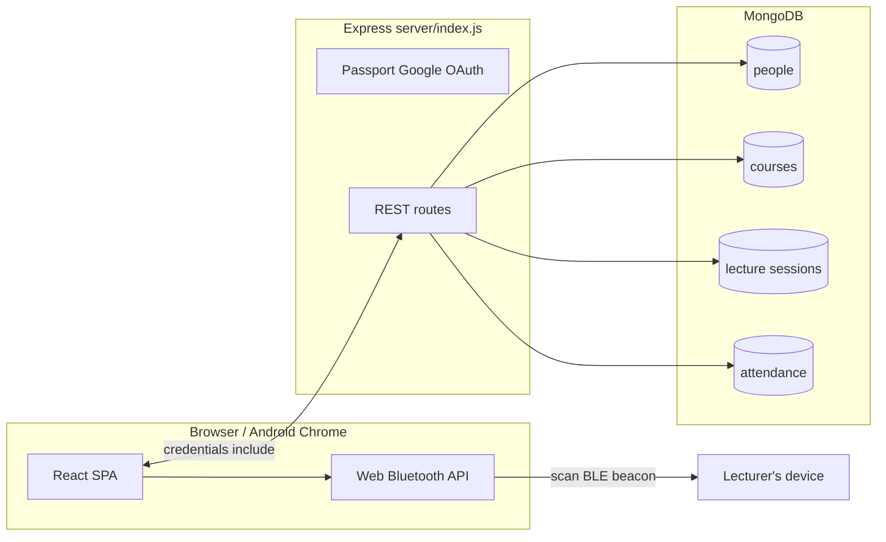

# UOP Attendance Management System


Role-based web application for lecture attendance at the **University of Peradeniya**. Students mark attendance for live sessions by scanning a **rotating BLE token** broadcast from the lecturer's device; lecturers and admins manage courses, sessions, and reporting.

> **This branch:** `feature/bluetooth` — web-only version using the **Web Bluetooth API** (`navigator.bluetooth`). No Capacitor, no native Android build. Runs entirely in a browser or Android WebView.
>
> **Native Android branch:** `capacitor-bluetooth` — same app wrapped with Capacitor for a native APK with full BLE support via `@capacitor-community/bluetooth-le`.

**Live URL:** https://attendance.eng.pdn.ac.lk

---

## Purpose

- Give students a single place to record attendance when a session is **actively running** (same calendar day and clock time as the session slot).
- Tie attendance to **verified identity** (Google OAuth + server session) and a **rotating BLE token** broadcast by the lecturer.
- Let staff create and operate sessions, control BLE broadcasting, export matrices, and maintain the lecturer directory.

---

## Core features

| Area | Capabilities |
|------|----------------|
| **Students** | Google sign-in; pick a running course; tap **📡 Scan for Bluetooth Attendance**. The browser uses `navigator.bluetooth.requestDevice` (Web Bluetooth API — Chrome on Android required) to find the session's BLE beacon, reads the rotating token from manufacturer data (`0xFFFF`), and posts to `/api/bluetooth-attendance`. |
| **Lecturers** | Staff console: assigned courses, session CRUD, **BLE broadcasting control** (📡 BT on/off + Start/Stop Broadcasting per session card), live BLE token + countdown display, attendance matrix export, and live attendance gating via the blinking **Live** badge. |
| **Admins** | Everything lecturers can do for any course, plus lecturer directory and multi-lecturer course assignment. |
| **System** | Rotating BLE token per session persisted in MongoDB (`bluetoothCode.js` + `BleToken` model, **15 s** rotation window applied lazily on access); non-recurring session auto-deactivate; date-sensitive keys use host-local Y-M-D. |

---

## Tech stack

| Layer | Technology |
|-------|------------|
| **Frontend** | React 19, React Router 6, Create React App (`react-scripts` 5), `fetch` + credentialed CORS. |
| **BLE (browser)** | **Web Bluetooth API** (`navigator.bluetooth`) — Chrome on Android only. No native wrapper or Capacitor. |
| **Backend** | Node.js, **Express 5**, Mongoose 9, Passport + `passport-google-oauth20`, `express-session` + **`connect-mongo`**, **`helmet`**, **`express-rate-limit`**, `cors`, `dotenv`. |
| **Data** | MongoDB (people, courses, lecture sessions, attendance, sessions). |
| **Tooling** | `concurrently` for `npm run dev`; optional Excel export via `xlsx` (`matrixExcel.js`). |

---

## Architecture overview



- **Single-process API** in `server/index.js`.
- **Session-based auth**: Passport serializes `Person._id`; staff vs student routes use `sessionStaffAuth` / `sessionStudentAuth` after reloading from MongoDB.
- **BLE token state** is persisted in **MongoDB** (`BleToken` collection via `bluetoothCode.js`) and survives server restarts; a TTL index auto-expires stale tokens.
- **Local dev split**: CRA dev is `http://localhost:3000`; API defaults to port **5000**.

---

## Project structure

```
.
├── public/
├── src/
│   ├── App.js
│   ├── index.js
│   ├── index.css
│   ├── api.js              # All HTTP helpers
│   ├── layouts/            # MarketingLayout, StudentLayout, AdminLayout
│   ├── components/         # Login, LectureEntry, AdminDashboard, LecturerDashboard …
│   └── utils/              # safeStorage, authRedirect, matrixExcel
├── server/
│   ├── index.js            # Express app, OAuth, all API routes
│   ├── models/             # Person, Course, LectureSession, Attendance, BleToken
│   └── lib/                # bluetoothCode.js, schedule.js, sessionExpiry.js
├── deploy/
│   └── nginx-app-domain.conf
├── package.json
└── README.md
```

---

## Environment variables

Create a **`.env`** in the project root (not committed).

| Variable | Required | Description |
|----------|----------|-------------|
| `MONGO_URI` | Recommended | Default: `mongodb://localhost:27017/attendance`. Also used by `connect-mongo`. |
| `GOOGLE_CLIENT_ID` | Yes | Google OAuth client ID |
| `GOOGLE_CLIENT_SECRET` | Yes | Google OAuth secret |
| `SESSION_SECRET` | **Required in production** | Server fails to boot in production if missing. |
| `BLE_SECRET` | Optional | BLE payload secret. If unset, the server uses a built-in default (`uop-ble-dev-secret-change-me`) so the app runs with zero config. Override in production. |
| `FRONTEND_URL` | Strongly recommended | Allowed CORS origin(s), comma-separated. |
| `APP_BASE_URL` | Recommended | Public origin for Google OAuth `callbackURL`. |
| `REACT_APP_API_BASE` | Optional | Absolute API origin when SPA and API differ. |
| `NODE_ENV` | Deployment | `production` enables Secure + SameSite=None cookies. |
| `PORT` | Optional | Express listen port; default **5000** |
| `TZ` | Optional | Server timezone. If unset, uses host system timezone. |
| `SESSION_EXPIRE_JOB_MS` | Optional | Non-recurring session sweep interval; min 10000, default 60000. |
| `CSP_EXTRA_CONNECT_SRC` | Optional (prod) | Extra origins for CSP `connect-src`. Comma-separated. |
| `CSP_REPORT_ONLY` | Optional (prod) | `1` = report-only mode; `0` = enforce. |

---


---

## Install, run, build

```bash
npm install
```

**Development (SPA + API):**
```bash
npm run dev
```
- Frontend: `http://localhost:3000`
- API: `http://localhost:5000`

**Run server unit tests (cross-platform — Windows/macOS/Linux):**
```bash
npm run test:server
```
> Uses `cross-env` so `NODE_ENV=test` is set correctly on PowerShell/cmd as well as POSIX shells.

**Production web build:**
```bash
npm run build
```
Serve the `build/` folder behind the same origin as `/api` and `/auth` via Nginx reverse proxy.

**First boot:** Mongoose auto-creates collections. Bootstrap admin `udayakavindadev@gmail.com` is seeded idempotently.

---

## Browser setup (required — Chrome on Android)

This branch targets **Chrome on Android only**. Both scanning (students) and broadcasting (lecturers) use the experimental Web Bluetooth advertising/scanning APIs, which are behind a flag.

1. Open Chrome on Android and go to `chrome://flags`.
2. Search for **"Experimental Web Platform features"** and set it to **Enabled**.
3. Restart Chrome.
4. Make sure the device **Bluetooth is ON** and the site is served over **HTTPS** (or `http://localhost` during development) — Web Bluetooth requires a secure context.
5. Students: tap **📡 Scan for Bluetooth Attendance** and pick the `UOP-XXXXXXXX` device in the OS picker.
6. Lecturers: enable **📡 BT on** for a session, then tap **📡 Start Broadcasting**.

> Desktop Chrome can scan with the flag enabled but cannot reliably advertise. Firefox and Safari are **not** supported.

---


---

## Student attendance flow

1. `GET /api/courses/running` populates the course combobox (polling every 10 s).
2. Student picks a running course and taps **📡 Scan for Bluetooth Attendance**.
3. Client calls `GET /api/bluetooth-target?courseId=…` → `{ deviceName }`. If BLE is disabled on the session the scan aborts.
4. `navigator.bluetooth.requestDevice({ filters: [{ manufacturerData: [{ companyIdentifier: 0xFFFF }] }] })` — opens the OS BLE picker filtered to advertisers carrying the `0xFFFF` manufacturer payload. (The browser broadcaster can't set a custom BLE local name, so the `UOP-XXXXXXXX` name is informational only on this web-only branch; the token check rejects wrong devices.)
5. `device.watchAdvertisements({ signal: abortController.signal })` — listens passively. A 30 s timeout aborts if no packet arrives.
6. On `advertisementreceived`: manufacturer data for company ID `0xFFFF` is the 16-character hex token encoded as UTF-8 (16 bytes); the client decodes it back to the 16-char hex string with `TextDecoder`.
7. `POST /api/bluetooth-attendance` `{ courseId, token }` — server calls `bluetoothCode.verifyToken(sessionId, token)`. On match, creates `Attendance` with `method: 'bluetooth'`.
8. On `{ success }` or `{ duplicate }`, the success screen is shown.

> **Browser requirement:** Web Bluetooth is only available in **Chrome on Android** (and desktop Chrome with a flag). Firefox and Safari are not supported.

---

## Lecturer BLE broadcast flow

1. Lecturer opens the **Sessions** tab and finds the session card.
2. Click **📡 BT on** — server assigns a unique device name (e.g. `UOP-A3F9`) via `PATCH /api/admin/sessions/:id/bluetooth/start` and immediately polls `GET /api/admin/sessions/:id/bluetooth-broadcast` to seed the rotating token.
3. The **BLE token panel** appears on the session card: device name, current token, and a countdown bar.
4. Click **📡 Start Broadcasting** — calls `navigator.bluetooth.advertise()` with manufacturer data (company ID `0xFFFF`, UTF-8 token bytes). Requires enabling "Experimental Web Platform features" at `chrome://flags` in Chrome on Android.
5. Token rotates every **15 seconds** server-side; the dashboard polls every 8 s and updates the advertisement automatically via `updateData`.
6. Both the current and previous token are accepted server-side to handle rotation boundary edge cases.
7. Click **⏹ Stop Broadcasting** or **BT off** to end the broadcast and disable BLE for the session.

---

## API overview

**Conventions**
- JSON bodies for `POST`/`PATCH`.
- **Cookie**: `attendance.sid` (HTTP-only); clients use `credentials: 'include'`.
- **401**: unauthenticated; **403**: wrong role or missing course access.

### Auth & profile

| Method | Path | Notes |
|--------|------|--------|
| GET | `/auth/google` | Starts OAuth. Rate-limited. |
| GET | `/auth/google/callback` | OAuth callback → redirect to `FRONTEND_URL`. Rate-limited. |
| GET | `/api/me` | `{ studentId, email, role, lecturerId }` |
| POST | `/api/logout` | Destroy session |
| GET | `/api/healthz` | `200 { status: 'ok' }` when Mongo is up |

### Read endpoints

| Method | Path | Notes |
|--------|------|--------|
| GET | `/api/courses` | Active courses. Auth required. |
| GET | `/api/courses/running` | Courses with an active session **right now**. Auth required. |

### Student (`role === 'student'`)

| Method | Path | Notes |
|--------|------|--------|
| GET | `/api/attendance-status?courseId=` | Same-day attendance for session-in-window |
| GET | `/api/bluetooth-target?courseId=` | Returns `{ deviceName }` when BT is enabled. |
| POST | `/api/bluetooth-attendance` | Body: `{ courseId, token }`. Validates 16-char hex token. Returns `{ success }` or `{ duplicate }`. Rate-limited. |

### Staff (`lecturer` or `admin`)

| Method | Path | Notes |
|--------|------|--------|
| GET | `/api/admin/courses` | Staff course list |
| POST | `/api/admin/courses` | Create course |
| DELETE | `/api/admin/courses/:courseId` | Delete (transactional: attendance, sessions, course) |
| PATCH | `/api/admin/courses/:courseId/disable` | |
| PATCH | `/api/admin/courses/:courseId/enable` | |
| PATCH | `/api/admin/courses/:courseId/assign-lecturer` | Admin; body: `{ lecturerIds }` array 1..5 |
| GET | `/api/admin/courses/:courseId/sessions` | |
| POST | `/api/admin/courses/:courseId/sessions` | Create session (rejects overlapping time windows) |
| GET | `/api/admin/sessions` | |
| GET | `/api/admin/sessions/running` | Sessions live right now (drives the **Live** badge + pause control). Scoped to the lecturer's courses; admins see all. |
| PATCH | `/api/admin/sessions/:sessionId/activate` | |
| PATCH | `/api/admin/sessions/:sessionId/deactivate` | |
| DELETE | `/api/admin/sessions/:sessionId` | Soft-delete; attendance preserved |
| PATCH | `/api/admin/sessions/:sessionId/attendance-paused` | Pause/resume student submissions |
| PATCH | `/api/admin/sessions/:sessionId/bluetooth/start` | Enable BLE; generates `UOP-XXXXXXXX` device name on first call |
| PATCH | `/api/admin/sessions/:sessionId/bluetooth/stop` | Disable BLE; removes the session's token from MongoDB |
| GET | `/api/admin/sessions/:sessionId/bluetooth-broadcast` | **Broadcaster app only.** Returns `{ deviceName, token, rotatesIn, rotationMs }` |
| GET | `/api/admin/courses/:courseId/attendance-matrix` | |
| GET | `/api/admin/lecturers?q=` | Admin |
| POST | `/api/admin/lecturers` | Admin |
| PATCH | `/api/admin/lecturers/:id` | Admin |
| DELETE | `/api/admin/lecturers/:id` | Admin |

---


---

## Content Security Policy

CSP is **enforced only when `NODE_ENV=production`**. Policy summary:

```
default-src 'self';
script-src 'self';
style-src 'self' 'unsafe-inline' https://fonts.googleapis.com;
font-src 'self' data: https://fonts.gstatic.com;
img-src 'self' data: blob:;
connect-src 'self' [+ CSP_EXTRA_CONNECT_SRC];
frame-ancestors 'none';
form-action 'self' https://accounts.google.com;
```

> Note: An Android WebView wrapper (e.g. the `capacitor-bluetooth` branch) bypasses the browser's CSP enforcement mechanism — CSP headers only apply when accessing the app from a real browser. The policy still protects browser users.

**Extending for split-host deploys:** If `REACT_APP_API_BASE` points to a different origin, add it to `CSP_EXTRA_CONNECT_SRC`.

---


---


---


---

## Testing

### Server unit tests

Run with:
```bash
npm run test:server
```

Covers:
- `bluetoothCode.js` — token generation, rotation, grace window, case-insensitivity, removeToken (15 tests)
- `schedule.js` — `toMinutes`, `hasScheduleOverlap`, `isNonRecurringExpired` (7 tests)
- `ble.routes.test.js` — BLE route integration with mocked models: auth/RBAC (401/403), `bluetooth/start`, `bluetooth/stop`, `bluetooth-broadcast`, `bluetooth-target`, and `bluetooth-attendance` end-to-end (29 tests)

### Frontend tests

CRA includes Jest via `react-scripts test`. Run with:
```bash
npm test
```

### What's not yet covered
- Concurrent student submission stress tests
- BLE scan simulation in JSDOM

## Known limitations

| Topic | Detail |
|-------|--------|
| **Web Bluetooth browser support** | Only Chrome on Android (and desktop Chrome with a flag). Firefox and Safari are not supported. |
| **BLE advertising from browser** | `navigator.bluetooth.advertise()` is experimental — requires "Experimental Web Platform features" flag in Chrome on Android. The **📡 Start Broadcasting** button in the Sessions tab will show an error with instructions if the API is unavailable. For reliable broadcasting without the flag, use the `capacitor-bluetooth` branch (native BLE via `BleClient.startAdvertising`). |
| **BLE token storage** | Tokens are persisted to MongoDB (`BleToken` collection) and survive server restarts. TTL index auto-expires tokens after 1 hour of inactivity. |
| **Single VM** | No failover or horizontal scaling without redesign. |

## Contributing

1. Work on a feature branch; keep changes focused.
2. Run `npm run build` before sharing frontend changes; `node --check server/index.js` after server edits.
3. Run `npm run test:server` to verify the BLE route and schedule tests pass.
4. Update this README when adding env vars, routes, or auth behavior.


---


