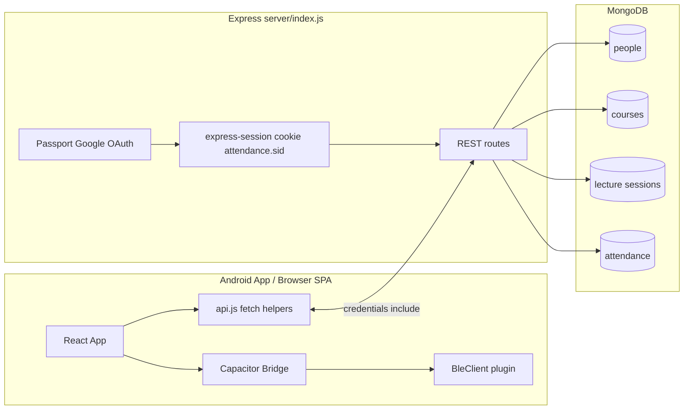

# UOP Attendance Management System

Role-based application for lecture attendance at the University of Peradeniya. Students mark attendance for **live** sessions by scanning a **rotating BLE token** broadcast from the classroom Bluetooth beacon; **lecturers** and **admins** manage courses, sessions, and reporting.

> **Branch:** `capacitor-bluetooth` — the React web app is wrapped with **Capacitor** so it can be built and installed as a native **Android APK**. The student BLE scan uses the native `@capacitor-community/bluetooth-le` plugin on Android (no browser dialog, works on all Android apps) and falls back to Web Bluetooth on plain browsers. See [Building the Android App](#building-the-android-app) below.
>
> **Web-only branch:** `feature/bluetooth` — identical server and UI, but no Capacitor; Web Bluetooth (Chrome on Android) only.

**Repository type:** private application (`package.json` → `"private": true`). No `LICENSE` file — treat usage and distribution as defined by your institution.

---

## Purpose

- Give students a single place to record attendance when a session is **actively running** (same calendar day and clock time as the session slot).
- Tie attendance to **verified identity** (Google OAuth + server session) and a **rotating BLE token** broadcast by the classroom Bluetooth beacon.
- Let staff create and operate sessions, control BLE broadcasting, export matrices, and maintain the lecturer directory.

---

## Core features

| Area | Capabilities |
|------|----------------|
| **Students** | Google sign-in; pick a **running** course; tap **📡 Scan for Bluetooth Attendance**. On the **native Android app** (this branch): `BleClient.requestLEScan` scans directly for the `UOP-XXXXXXXX` beacon — no device picker dialog. In a **browser**: Web Bluetooth picker (Chrome on Android only). Either path reads the rotating 8-byte token from manufacturer data (`0xFFFF`) and posts to `/api/bluetooth-attendance`. |
| **Lecturers** | Staff console: assigned courses, session CRUD, **BLE broadcasting control** (start/stop per session card), live BLE token display, attendance matrix export, projector view, and live attendance gating via the blinking **Live** badge. |
| **Admins** | Everything lecturers can do for any course, plus lecturer directory and multi-lecturer course assignment. |
| **System** | **in-memory BLE token** per session (`bluetoothCode.js`, automatic 15 s rotation via `setInterval`); non-recurring session auto-deactivate; date-sensitive keys use **host-local Y-M-D**. |

---

## Tech stack

| Layer | Technology |
|-------|------------|
| **Frontend** | React 19, React Router 6, Create React App (`react-scripts` 5), `fetch` + credentialed CORS. |
| **Native wrapper** | **Capacitor 8** (`@capacitor/core`, `@capacitor/android`), **`@capacitor-community/bluetooth-le` 8** for native BLE scanning. |
| **Backend** | Node.js, **Express 5**, Mongoose 9, Passport + `passport-google-oauth20`, `express-session` + **`connect-mongo`**, **`helmet`**, **`express-rate-limit`**, `cors`, `dotenv`. |
| **Data** | MongoDB (people, courses, lecture sessions, attendance, sessions). |
| **Tooling** | `concurrently` for `npm run dev`; optional Excel export via `xlsx` (`matrixExcel.js`). |

---

## Architecture overview



- **Capacitor WebView**: the React `build/` folder is loaded inside a native Android WebView. All existing React components, API calls, and auth flow work without changes.
- **Native BLE path**: `Capacitor.isNativePlatform()` is checked at runtime in `LectureEntry.jsx`. On Android, `BleClient.requestLEScan` is used directly; on a browser, `navigator.bluetooth.requestDevice` is used as a fallback.
- **Single-process API** in `server/index.js` (models, auth helpers, and HTTP handlers).
- **Session-based auth**: Passport serializes `Person._id`; staff vs student routes use `sessionStaffAuth` / `sessionStudentAuth` after reloading from MongoDB.
- **BLE token state** lives in **process memory** (`bluetoothCode.js` Map store), not MongoDB — server restarts drop rotation state.
- **Local dev split**: CRA dev is `http://localhost:3000`; API defaults to port **5000**.

---

## Project structure

```
.
├── android/                # Capacitor Android project (open in Android Studio)
│   ├── app/
│   │   ├── src/main/
│   │   │   ├── AndroidManifest.xml   # BLE permissions declared here
│   │   │   └── java/lk/uop/attendance/MainActivity.java
│   │   └── build.gradle
│   ├── build.gradle
│   └── settings.gradle
├── public/                 # CRA static assets
├── src/
│   ├── App.js              # Routes, auth guards
│   ├── index.js            # StrictMode, BrowserRouter, ErrorBoundary
│   ├── index.css           # Global styles
│   ├── layouts/            # MarketingLayout, StudentLayout, AdminLayout
│   ├── components/         # Login, GoogleSuccess, LectureEntry, AdminDashboard, …
│   ├── api.js              # All HTTP helpers; safeFetchJson; 401 → notifySessionInvalid
│   └── utils/              # safeStorage, authRedirect, matrixExcel
├── server/
│   ├── index.js            # Express app, OAuth, all API routes
│   ├── models/             # Person, Course, LectureSession, Attendance
│   └── lib/                # bluetoothCode.js, bluetoothCode.js, schedule.js, sessionExpiry.js
├── capacitor.config.ts     # Capacitor: appId, webDir, BLE display strings
├── deploy/
│   └── nginx-app-domain.conf
├── package.json
└── README.md
```

---

## Environment variables

Create a **`.env`** in the project root (not committed).

| Variable | Required | Description |
|----------|----------|-------------|
| `MONGO_URI` | Recommended | Default: `mongodb://localhost:27017/attendance`. Also used by `connect-mongo`. |
| `GOOGLE_CLIENT_ID` | Yes | Google OAuth client ID |
| `GOOGLE_CLIENT_SECRET` | Yes | Google OAuth secret |
| `SESSION_SECRET` | **Required in production** | Server fails to boot in production if missing. |
| `FRONTEND_URL` | Strongly recommended | Allowed CORS origin(s), comma-separated. |
| `APP_BASE_URL` | Recommended | Public origin for Google OAuth `callbackURL`. |
| `REACT_APP_API_BASE` | Optional | Absolute API origin when SPA and API differ. |
| `NODE_ENV` | Deployment | `production` enables Secure + SameSite=None cookies. |
| `PORT` | Optional | Express listen port; default **5000** |
| `TZ` | Optional | Server timezone. If unset, uses host system timezone. |
| `SESSION_EXPIRE_JOB_MS` | Optional | Non-recurring session sweep interval; min 10000, default 60000. |
| `CSP_EXTRA_CONNECT_SRC` | Optional (prod) | Extra origins for CSP `connect-src`. Comma-separated. |
| `CSP_REPORT_ONLY` | Optional (prod) | `1` = report-only mode; `0` = enforce. |

---

## Install, run, build

```bash
npm install
```

**Development (SPA + API):**
```bash
npm run dev
```
- Frontend: `http://localhost:3000`
- API: `http://localhost:5000`

**Production web build:**
```bash
npm run build
```

**Sync web build into Android project:**
```bash
npm run cap:sync          # builds React then runs npx cap sync
```

**Open Android Studio (build + run on device):**
```bash
npm run cap:android       # builds React, syncs, opens Android Studio
```

---

## Building the Android App

### Prerequisites

Install these once on your development machine:

| Tool | Where to get it | Notes |
|------|----------------|-------|
| **Android Studio** | [developer.android.com/studio](https://developer.android.com/studio) | Includes SDK, emulator, Gradle |
| **JDK 17+** | Bundled with Android Studio | Set `JAVA_HOME` if needed |
| **Node.js 18+** | [nodejs.org](https://nodejs.org) | Already needed for the web app |
| **USB cable** (for physical device) | Any data-capable USB cable | Enable USB Debugging on the phone |

> Android Studio is ~1 GB download. The first Gradle build downloads dependencies (~500 MB) — do this on a good network connection.

---

### Step 1 — Install dependencies

```bash
npm install
```

This installs `@capacitor/core`, `@capacitor/android`, and `@capacitor-community/bluetooth-le` along with all web dependencies.

---

### Step 2 — Build the React app

```bash
npm run build
```

Capacitor copies the `build/` folder into the Android project's assets. You must rebuild every time you change the frontend code.

---

### Step 3 — Sync into the Android project

```bash
npx cap sync android
```

This does two things:
1. Copies `build/` into `android/app/src/main/assets/public/`
2. Updates Gradle dependencies for any Capacitor plugins

Or run both steps 2 and 3 together:

```bash
npm run cap:sync
```

---

### Step 4 — Open Android Studio

```bash
npx cap open android
```

Or use the combined script that does steps 2–4:

```bash
npm run cap:android
```

Android Studio will open the `android/` project. The first time it opens it will sync Gradle — wait for the progress bar in the bottom bar to finish (can take 2–5 minutes).

---

### Step 5 — Connect a device

**Option A — Physical Android device (recommended for BLE testing):**

1. On your Android phone: go to **Settings → About phone** and tap **Build number** 7 times to enable Developer Options.
2. Go to **Settings → Developer options** and enable **USB Debugging**.
3. Connect the phone to your computer with a USB cable.
4. Accept the "Allow USB Debugging?" dialog on the phone.
5. The device should appear in the device selector dropdown at the top of Android Studio.

**Option B — Android emulator:**

1. In Android Studio: **Tools → Device Manager → Create Device**.
2. Choose a phone (e.g. Pixel 6), API 33+.
3. Click the ▶ play button next to the emulator.

> **BLE note:** The emulator does **not** support real Bluetooth hardware. You can test the UI flow with an emulator, but actual BLE scanning (token reception) requires a physical device. Use Option A for end-to-end BLE testing.

---

### Step 6 — Run the app

1. Select your device from the dropdown at the top of Android Studio.
2. Click the green **Run** button (▶) or press **Shift+F10**.
3. Android Studio builds the APK, installs it on the device, and launches it.
4. The first build takes 2–3 minutes. Subsequent builds are faster.

The app will open showing the attendance web app inside a native WebView. It connects to the server URL configured in your environment.

---

### Step 7 — Configure the server URL

The Capacitor app's WebView needs to reach your API server. By default the React app uses `REACT_APP_API_BASE` or falls back to `localhost:5000` when on port 3000.

**For development** — run your backend and point the app at it:

```bash
# In .env (create it if it doesn't exist):
REACT_APP_API_BASE=http://YOUR_COMPUTER_IP:5000
```

Then rebuild and sync:
```bash
npm run cap:sync
```

Find your computer's IP:
- **Windows:** `ipconfig` → IPv4 Address
- **Mac/Linux:** `ifconfig` or `ip addr` → look for `192.168.x.x`

Make sure your phone and computer are on the same Wi-Fi network.

**For production** — use the deployed server URL:
```bash
# In .env:
REACT_APP_API_BASE=https://attendance.eng.pdn.ac.lk
```

---

### Step 8 — BLE Permissions (already configured)

The `android/app/src/main/AndroidManifest.xml` already has all required BLE permissions:

```xml
<!-- Android < 12 -->
<uses-permission android:name="android.permission.BLUETOOTH" android:maxSdkVersion="30" />
<uses-permission android:name="android.permission.BLUETOOTH_ADMIN" android:maxSdkVersion="30" />
<uses-permission android:name="android.permission.ACCESS_FINE_LOCATION" android:maxSdkVersion="30" />

<!-- Android 12+ -->
<uses-permission android:name="android.permission.BLUETOOTH_SCAN"
    android:usesPermissionFlags="neverForLocation" />
<uses-permission android:name="android.permission.BLUETOOTH_CONNECT" />
```

The `neverForLocation` flag means the app does **not** need location permission on Android 12+ — it only uses Bluetooth for attendance, not positioning.

On first scan the app will show a **"Allow Bluetooth?"** system dialog. The user must accept it.

---

### Building a Release APK

To distribute the app outside of Android Studio (e.g. sideload via USB):

1. **Generate a keystore** (one-time):
   ```bash
   keytool -genkey -v -keystore uop-attendance.jks \
     -alias uop-attendance -keyalg RSA -keysize 2048 -validity 10000
   ```

2. **Configure signing** in `android/app/build.gradle`:
   ```groovy
   android {
     signingConfigs {
       release {
         storeFile file('path/to/uop-attendance.jks')
         storePassword 'YOUR_STORE_PASSWORD'
         keyAlias 'uop-attendance'
         keyPassword 'YOUR_KEY_PASSWORD'
       }
     }
     buildTypes {
       release {
         signingConfig signingConfigs.release
         minifyEnabled false
       }
     }
   }
   ```

3. **Build the release APK** in Android Studio:
   **Build → Generate Signed Bundle / APK → APK → Release → Finish**

   The APK will be at `android/app/release/app-release.apk`.

4. **Install on a device:**
   ```bash
   adb install android/app/release/app-release.apk
   ```

---

### Workflow for ongoing development

Every time you change frontend code:

```bash
npm run cap:sync         # rebuild React + sync into Android project
# then in Android Studio: click Run (▶)
```

Every time you change `capacitor.config.ts`:
```bash
npx cap sync android     # re-syncs config and plugin settings
```

---

## Student attendance flow (implementation)

The scan path is chosen at runtime by `Capacitor.isNativePlatform()` in `LectureEntry.jsx`.

1. `GET /api/courses/running` populates the course combobox (polling every 10 s).
2. Student picks a running course and taps **📡 Scan for Bluetooth Attendance**.
3. Client calls `GET /api/bluetooth-target?courseId=…` → `{ deviceName }`. If BT is disabled the scan aborts.

**Native Android app path (this branch):**

4. `BleClient.initialize({ androidNeverForLocation: true })` — requests Bluetooth permission from the user if not yet granted.
5. `BleClient.requestLEScan({ name: deviceName }, callback)` — starts scanning in the background, no device picker dialog. Filters for the session's `UOP-XXXXXXXX` beacon.
6. `callback` fires for each matching advertisement. Manufacturer data for company ID `0xFFFF` is read as 8 bytes → 16-char hex token. `BleClient.stopLEScan()` is called once a token is found.

**Browser fallback path (Chrome on Android):**

4. `navigator.bluetooth.requestDevice({ filters: [{ name: deviceName }] })` — opens the OS BLE picker, pre-filtered to the beacon.
5. `device.watchAdvertisements({ signal: abortController.signal })` — listens for advertisements. A 30 s timeout aborts if no packet arrives.
6. On `advertisementreceived`: manufacturer data for `0xFFFF` → 16-char hex token.

**Both paths continue:**

7. `POST /api/bluetooth-attendance` `{ courseId, token }` — server calls `bluetoothCode.verifyToken(sessionId, token)`. On match, creates `Attendance` with `method: 'bluetooth'`.
8. On `{ success }` or `{ duplicate }`, the success screen is shown.

**Staff live control:**
- **📡 BT on / BT off** pill buttons on each session card control `bluetoothEnabled`.
- The **blinking Live badge** pauses/resumes student submissions independently of BLE broadcasting.
- A **native broadcaster app** must call `GET /api/admin/sessions/:id/bluetooth-broadcast` and advertise the returned token; the web dashboard only enables/disables.

---

## API overview

**Conventions**
- JSON bodies for `POST`/`PATCH`.
- **Cookie**: `attendance.sid` (HTTP-only); clients use `credentials: 'include'`.
- **401**: unauthenticated; **403**: wrong role or missing course access.

### Auth & profile

| Method | Path | Notes |
|--------|------|--------|
| GET | `/auth/google` | Starts OAuth. Rate-limited. |
| GET | `/auth/google/callback` | OAuth callback → redirect to `FRONTEND_URL`. Rate-limited. |
| GET | `/api/me` | `{ studentId, email, role, lecturerId }` |
| POST | `/api/logout` | Destroy session |
| GET | `/api/healthz` | `200 { status: 'ok' }` when Mongo is up |

### Read endpoints

| Method | Path | Notes |
|--------|------|--------|
| GET | `/api/courses` | Active courses. Auth required. |
| GET | `/api/courses/running` | Courses with an active session **right now**. Auth required. |

### Student (`role === 'student'`)

| Method | Path | Notes |
|--------|------|--------|
| GET | `/api/attendance-status?courseId=` | Same-day attendance for session-in-window |
| GET | `/api/bluetooth-target?courseId=` | Returns `{ deviceName }` when BT is enabled. |
| POST | `/api/bluetooth-attendance` | Body: `{ courseId, token }`. Validates 16-char hex token. Returns `{ success }` or `{ duplicate }`. Rate-limited. |

### Staff (`lecturer` or `admin`)

| Method | Path | Notes |
|--------|------|--------|
| GET | `/api/admin/courses` | Staff course list |
| POST | `/api/admin/courses` | Create course |
| DELETE | `/api/admin/courses/:courseId` | Delete (transactional: attendance, sessions, course) |
| PATCH | `/api/admin/courses/:courseId/disable` | |
| PATCH | `/api/admin/courses/:courseId/enable` | |
| PATCH | `/api/admin/courses/:courseId/assign-lecturer` | Admin; body: `{ lecturerIds }` array 1..5 |
| GET | `/api/admin/courses/:courseId/sessions` | |
| POST | `/api/admin/courses/:courseId/sessions` | Create session (rejects overlapping time windows) |
| GET | `/api/admin/sessions` | |
| GET | `/api/admin/sessions/:sessionId/current-code` | Single session live code |
| PATCH | `/api/admin/sessions/:sessionId/activate` | |
| PATCH | `/api/admin/sessions/:sessionId/deactivate` | |
| DELETE | `/api/admin/sessions/:sessionId` | Soft-delete; attendance preserved |
| PATCH | `/api/admin/sessions/:sessionId/attendance-paused` | Pause/resume student submissions |
| PATCH | `/api/admin/sessions/:sessionId/bluetooth/start` | Enable BLE; generates `UOP-XXXXXXXX` device name on first call |
| PATCH | `/api/admin/sessions/:sessionId/bluetooth/stop` | Disable BLE; clears in-memory token |
| GET | `/api/admin/sessions/:sessionId/bluetooth-broadcast` | **Broadcaster app only.** Returns `{ deviceName, token, rotatesIn, rotationMs }` |
| GET | `/api/admin/courses/:courseId/attendance-matrix` | |
| GET | `/api/admin/lecturers?q=` | Admin |
| POST | `/api/admin/lecturers` | Admin |
| PATCH | `/api/admin/lecturers/:id` | Admin |
| DELETE | `/api/admin/lecturers/:id` | Admin |

---

## Content Security Policy

CSP is **enforced only when `NODE_ENV=production`**. Policy summary:

```
default-src 'self';
script-src 'self';
style-src 'self' 'unsafe-inline' https://fonts.googleapis.com;
font-src 'self' data: https://fonts.gstatic.com;
img-src 'self' data: blob:;
connect-src 'self' [+ CSP_EXTRA_CONNECT_SRC];
frame-ancestors 'none';
form-action 'self' https://accounts.google.com;
```

> Note: The Capacitor Android WebView bypasses the browser's CSP enforcement mechanism — CSP headers only apply when accessing the app from a real browser. The policy still protects browser users.

**Extending for split-host deploys:** If `REACT_APP_API_BASE` points to a different origin, add it to `CSP_EXTRA_CONNECT_SRC`.

---

## Known limitations

| Topic | Detail |
|-------|--------|
| **BLE on native app** | Full BLE scanning via `@capacitor-community/bluetooth-le` on the Android app. No browser dialog — scans directly. Requires Android 6+ with Bluetooth enabled. |
| **BLE in browser** | `navigator.bluetooth.requestDevice` + `watchAdvertisements` is only available on **Chrome for Android** (and Chrome OS). Not available in Safari, Firefox, or Chrome on iOS. Students on unsupported browsers see an explicit error message. |
| **iOS** | Capacitor supports iOS with `@capacitor/ios`, but this branch only ships the Android project. An iOS build would require adding `npx cap add ios` on a Mac with Xcode. |
| **BLE broadcaster** | The web dashboard cannot advertise BLE — browsers have no BLE peripheral API. A **separate native app** must call `GET /api/admin/sessions/:id/bluetooth-broadcast` and broadcast the returned token. |
| **BLE token rotation** | Automatic every **15 seconds** via a `setInterval` in `bluetoothCode.js`. No poll required to trigger rotation. |
| **Token storage** | In-memory per server process; not durable across restarts or horizontal scaling. |
| **Emulator BLE** | Android emulators do not support real Bluetooth hardware. BLE scanning requires a physical device. |

---

## Troubleshooting

### Android build issues

| Symptom | Fix |
|---------|-----|
| `sdk.dir` error when opening Android Studio | Open Android Studio → SDK Manager → confirm Android SDK is installed; or set `ANDROID_SDK_ROOT` env var |
| Gradle sync fails ("Could not resolve…") | Check internet connection; try **File → Sync Project with Gradle Files** |
| `JAVA_HOME` not set | Android Studio bundles a JDK — in Android Studio: **File → Project Structure → SDK Location → JDK location** |
| Build fails: "Manifest merger failed" | Check `android/app/src/main/AndroidManifest.xml` for duplicate permission tags |
| App installed but shows blank white screen | The `build/` folder wasn't synced — run `npm run cap:sync` then Run again |
| "ERR_CONNECTION_REFUSED" in app | The React app can't reach the API — check `REACT_APP_API_BASE` points to your running server |

### BLE issues on device

| Symptom | Fix |
|---------|-----|
| "Bluetooth initialization failed" | Enable Bluetooth on the phone; accept the Bluetooth permission dialog |
| Scan starts but never finds the beacon | Broadcaster app is not running; student is too far from the beacon (BLE range typically < 10 m); check `bluetoothEnabled` on the session card |
| "No Bluetooth signal received in 30 s" | Move closer to the classroom; check the session has BT enabled (staff must tap **📡 BT on**) |
| "Invalid or expired Bluetooth token" | Token rotated just as the packet was scanned (15 s window); tap Scan again immediately for the fresh token |
| BLE permission denied permanently | Go to phone **Settings → Apps → UOP Attendance → Permissions → Nearby devices → Allow** |

### Web app issues

| Symptom | Fix |
|---------|-----|
| CORS errors | `FRONTEND_URL` must exactly match browser origin; `credentials: true` on server |
| OAuth redirect mismatch | Google Console redirect URI must match `APP_BASE_URL + /auth/google/callback` |
| 401 after deploy | Check `SESSION_SECRET`, cookie domain/protocol, and whether hostname changed |
| "Scan" button disabled in browser | Web Bluetooth not supported on this browser — student must use Chrome on Android |

---

## Development conventions

- **API client:** Add new calls to `src/api.js` using `safeFetchJson`; preserve `credentials: 'include'` and 401 handling.
- **Capacitor changes:** After changing `capacitor.config.ts` or native plugin config, run `npx cap sync`.
- **Styles:** Global `src/index.css`; layout-specific `src/layouts/layouts.css`.
- **Error handling:** Root `ErrorBoundary`; dev-only `unhandledrejection` logging in `src/index.js`.

---

## Codebase invariants

| Item | Current state | Source |
|------|---------------|--------|
| Student scan — native | `BleClient.initialize + requestLEScan` (no dialog); path activated by `Capacitor.isNativePlatform() === true` | `src/components/LectureEntry.jsx` |
| Student scan — browser | `navigator.bluetooth.requestDevice + watchAdvertisements`; fallback when not native | `src/components/LectureEntry.jsx` |
| BLE token | 8 random bytes = 16-char hex. Rotates every **10 seconds** via `setInterval` in `bluetoothCode.js`. Verified by string equality. Stored in `Attendance.lectureCode`. | `server/lib/bluetoothCode.js` |
| BLE device name | `'UOP-' + 4 random hex bytes uppercase`. Generated once on first `bluetooth/start`, persisted in `LectureSession.bluetoothDeviceName`. | `server/lib/bluetoothCode.js` |
| Attendance method | `['google', 'bluetooth']` — `'bluetooth'` for BLE-recorded rows. | `server/models/Attendance.js` |
| Token storage | BLE token lives in `bluetoothCode.js` in-process Map. Server restart resets tokens. |
| Sessions persistence | `express-session` + `connect-mongo` (TTL 7 d). Survives restarts. | `server/index.js` |
| Security middleware | `helmet` (prod CSP), `cors` (allow-list), `express-rate-limit` (per-user/IP). | `server/index.js` |
| Course ownership | Multi-owner: `Course.lecturers` array, 1..5 unique lecturer IDs. | `server/models/Course.js` |
| Course delete | Transactional: attendance + sessions + course deleted atomically. | `server/index.js` |
| Duplicate attendance | `{ success: true, duplicate: true }` for same-session same-day re-records; never 500. | `server/index.js` |
| Public discovery | `/api/courses` and `/api/courses/running` require auth. | `server/index.js` |
| Timezone | Server uses host local time (`localYmd`) unless `TZ` is set. | `server/index.js` |
| Bootstrap admin | Startup ensures `udayakavindadev@gmail.com` is an active admin. | `server/index.js` |
| Capacitor app ID | `lk.ac.pdn.eng.attendance` | `capacitor.config.ts` |
| Android BLE permissions | `BLUETOOTH_SCAN` (neverForLocation) + `BLUETOOTH_CONNECT` for API 31+; legacy permissions for API ≤ 30. | `android/app/src/main/AndroidManifest.xml` |

---

## Contributing

1. Work on a feature branch; keep changes focused.
2. After changing frontend code, run `npm run cap:sync` to keep the Android project in sync.
3. Run `npm run build` before sharing frontend changes; `node --check server/index.js` after server edits.
4. Run `npm run test:server` to verify the BLE route tests pass.
5. Update this README when adding env vars, routes, or auth behavior.
